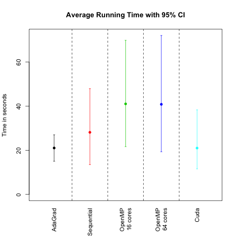

# CS 205 FINAL PROJECT REPORT 

## Parallelizing Neural Network with Improved Performance 
Chang Liu, Greyson Liu, Kamrine Poels, Linglin Huang

## Background
Despite the availability of high-frequency stock market data, its use in forecasting stock prices is studied to a lesser extent. Similarly, despite the recent success of neural network on as a forecasting method, its power in forecasting high-frequency dynamics has been relatively overlooked. In addition, most of the studies in the literature have been focused on stock market indices instead of individual stocks. A possible explanation is the intractable computational intensity of training neural networks on the massive volume of high-frequency data of individual stocks. This motivates our study on applying parallelism to the training task and evaluate its performance to demonstrate weak and strong scaling.

Parallel neural network has also been a topic of great interest. There are generally two aspects of parallelisation: data parallel and model parallel. Data Parallel is straightforward. Its correctness is mathematically supported, and is very commonly implemented with MPI [4]. Model parallel is more complecated. Such methods usually use multiple cores to compute values assocaited with multiple groups of neurons. This is usually implemented with openMP and GPU. However, it could be tricky to take care of the communications between cores/threads and to combine results (usually gradients) effectively.

## Data
We formulate the task as a prediction problem, using lagged previous prices of individual stocks to predict future prices at the minute level. The high-frequency consolidated trade data for the US equity market comes from NYSE Trade and Quote (TAQ) database, available by the WRDS research center. 

Specifically, the inputs are price and volume information at or before minute t for all stocks except stock j. 
Technical indicators of price series includes:

 1. Exponential Moving Averages (EMA) and Moving Averages (MA)
 2. Past k-period log returns
 3. PSY: fraction of upward movement in the past k-period
 4. Price and returns volatility over k periods
 5. Momentum: Change in price in k periods
 6. Disparity: last available price over MA
 
The output is the predicted return at minute t+1 for stock j. We normalize all the input and output variables using z-score and unit norm per feature.

## Methods

### Neural Network Architecture

For the prediction method, multi-layer Artificial Neural Networks (ANN) using back-propagation algorithm has shown promising results in stock index prices compared with traditional methods [1]. Note that the traditional gradient descent algorithm of back-propagation is sequential by nature. We will therefore apply a technique that combines MPI with OpenMP/CUDA for BLAS to parallelize the training process: asynchronized multiple sub-neural networks[3] with nested parallel batch  **Stochastic Gradient Descent** [2].

The goal of our project is to implement a two-level parallelization model by combining MPI and OpenMP/CUDA. Unfortunately, developing executable code using OpenMP (via Cython) resulted in an onerous and difficult task, therefore, we opted for existing optimization algorithms for the update of gradients, then analyzing the nature of our algorithm by comparing time until convergence as well as the average runtime for each training iteration at fixed batchsizes. Nonetheless, we describe our desired design and the design we used for our project below.

### Neural Network Architecture (hyperparameters)

We implement a **fully connected** network with:

1. L = 4 layers
2. number of neurons = 42,24,12,1; fewer neurons in deeper layers (pyramidal architecture)
3. Optimizer ADAM learning rate, other parameters such as momentum 
4. ReLu/MSE activation, linear activation for output node
5. L2 and maxnorm regularization, early stopping(patience=5), dropouts(20%)

### Parallelism Architecture

We execute data and model parallelism at two levels. Firstly, each machine (e.g. an Odyssey node) will store a Data Shard (a subset of data) and train a model replica independently and asynchronously (see Figure 1.) Each replica will fetch weights (𝑤) from the parameter server (the master node), compute ∆𝑤, and push ∆𝑤 to the server or master node. The parameter server updates the parameter set whenever it receives ∆𝑤 from a model replica. This archetecture is reasonable because the updating and validation process envolves much less computation than back-propagration in the model replicas. We analyzed three different optimization algorithms for the update of the weights. The fetching and pushing weights and gradient weights to the master node was implemented with MPI (`mpi4py` package).

*Figure 1: Parallelised Neural Network Architecture [3]. Model replicas asynchronously fetch parameters 𝑤 and push ∆𝑤 to the parameter server.*

Secondly, each model replica aimed to compute ∆𝑤 by averaging the mini-batch gradients from 64 or 32 (depend on number of cores in a node) parallel threads (see Figure 2). We attempted to implement this level of parallelism with OpenMP (Cython parallel module). However, we were unsuccessful with this implementation, so we used OpenMP/CUDA for BLAS in each model replica (to parallel matrix computations) and tested at different cores. 

*Figure 2: Desired parallelization in each model replica.*

*Figure 3: Real architecture of our algorithm. Note that node 0 is the master node, where the optimization takes place, and node 1 through 7 (number of total nodes can and will vary) is a model replica, where the calculationg of the gradient of weight occurs.*

### Optimization methods

- **Adaptive Gradient Algorithm (AdaGrad)**: modified SGD with parameter learning rate. Informally, this increases the learning rate for more sparse parameters and decreases the learning rate for less sparse ones. This strategy improves convergence performance where data is sparse. This optimization method is run with MPI arhitecture (see *Figure 3*). Specifically, there are two message passing schemes suitable for different hardware settings:
    - Instant updating: each model replica communicates with the parameter server for every batch iteration. This scheme is suitable when the communication cost between nodes is small, e.g. the seas\_iacs partition on Odyssey. It is very close to the sequential version, and converges most quickly (least number of iterations) since it makes use of information from all data shards.
    - Cumulative updating: each model replica communicates with the parameter server after a few (e.g. 20) batch iterations. This scheme is suitable when the communication cost is large since fewer message passings are needed here. However, it is possible for a model replica to get over-fitted since it only has a subset of data.

- **Hessian-Free (Truncated Newton Method)**: an approximation of the Hessian is calculated, which saves time and computational resources, when updating using the well known Newton method. However, this method updates the model parameters sequentially and does not naturally fit into our MPI parallel architecture. Therefore, we implemented a standalone version with one level of parallelisation (using GPU as a feature of the `hessionfree` pacakge). 

- **Particle Swarm Optimization (PSO)**: computational method that solves a problem by having a population of candidate solutions, or particles, and moving these around in the search-space according to simple mathematical formulae over the particle's position and velocity. Each particle's movement is influenced by its local best known position, but is also guided toward the best known positions in the search-space, which are updated as better positions are found by other particles. This is expected to move the swarm toward the best solutions.

AdaGrad is implemented using [Keras](https://keras.io), and Hessian-free is applied using [hessianfree](http://pythonhosted.org/hessianfree/index.html), parallel Particle Swarm Optimization is implemented mulitprocessing module in python and adapted from [here] (https://jamesmccaffrey.wordpress.com/2015/06/09/particle-swarm-optimization-using-python/). 

#### Validation and Testing 

Because of the time series nature of the high-frequency data, we employ a walk-forward method that is suited for back-testing financial time series model, instead of k-fold cross-validation, to avoid forward-looking bias. For each rolling window, we determine if for each  epoch, our iterative machine learning algorithms (Adagrad, Hessian Free, Particle Swarm Optimization) should stop the training process based on the loss calculated on the "validation timestep". If we do terminate the algorithm, we then evaluate the performance of the final model in the "testing timestep". For simplicity and fair comparison, we used window size = 1 for all the algorithms, because for some algorithm like sequential Particle Swarm Optimization, running one window frame can take more than 7 hours on Odyssey. 

We test the performance of all models on predicting second-level stock returns of Goldman Sachs in 2016. With an input size of 100,000 observations, we train a model with 75% of the stock prices and test it on the rest of the data. The batch size is 1,024 or 4096 per model replica, a neural network has 2 hidden layers with 24, 12 neurons, respectively. The maximum number of epochs (loosely defined as the number of minibatch update) was set to **2000, and the initial learning rate is 0.01**. The activation function is Relu except on the last layer, the output, where the activation function is linear. 

Within the training data, we use 80% of this dataset to train in the model replicas. After ∆𝑤 is sent to the master node, 𝑤 is updated and used to test on the rest of the training data (other 20%). As predictions get closer to true outcomes (absolute difference of loss of (i+1) iteration and i iteration is less than 10e-4), the program is stopped and we deduced convergence. If predictions were distant from true values, training continued.

#### Outline of Experiments

We present the layout of our model combinations and their analysis. First, we are interested in the observeded time until convergence and average time per iteration. **We also record and compare accuracy among the models.**. 

<!--  -->

*Table 1: We run Hessian-free and AdaGrad in GPU. Not included in this table, we also run AdaGrad with 3, 4, 5, 6, 7 and 8 cores at 4 cores each (using MPI), but we force an earlier stop (maximum 2000 iterations).*

Also, we run 

## Results

## Conclusions and Discussions

In our experiments, we find there are significant overheads for initializing MPI, OpenMP and GPU settings, but did not observe too much communication cost. We think this is because the nodes in seas\_iacs partition on Odyssey are connected with high-speed Infiniband network, and the nodes finish the same amount of computation at different times due to differences in computational throughput. If the nodes have very similar computational performance in the MPI world, we may also vary the batch size for each model replica such that the updating process can be asyncronized.

## Software 

# *END HERE*

First, we test the correctness of MPI implementation with data generated from a simple linear model. This is a reasonable *naïve* test case because ANN with zero hidden layers reduces to a linear regression if the activation function is linear.

*Figure 3: MPI simulation, loss function. The loss decreases almost exponentially as the number of epochs increases.*

*Figure 4: Convergence of parameters. All three parameters converged to their true values, respectively.*

The decrease in the loss between predicted and observed outcomes and the convergence to the true value demonstrate that our MPI algorithm operates correctly.

#### Performance of a Model Replica

We test the performance of a single model replica using each of the model replica algorithms versus CUDA implementation on predicting minute-level stock returns of Goldman Sachs in 2016. With an input size of 100,000 observations, we train a model with 75% of the stock prices and test it on the rest of the data. The batch size is 1,024 per model replica, a neural network has 3 hidden layers with 24, 12, 6 neurons, respectively. The maximum number of epochs (loosely defined as an iteration over iterations) was set to 100, and the initial learning rate is 0.001. The activation function is Relu except on the last layer, the output, where the activation function is linear. Below we show the average running time of the algorithms, including CUDA, which still outperforms the other optimization methods. We ran a total of 100 models for each algorithm.

<!-- Secondly, we tested the performance of a single model replica using OpenMP versus CUDA implementation on predicting minute-level stock returns of Goldman Sachs in 2016. We trained a fully-connected neural network with 4 layers (# units = [42,24,12,1]) and stop training once validation is not improving for 5 epochs. For speedup experiments, epochs are set to 100. 

 

*Figure 5: Convergence of loss function of different implementations (Max epochs = 100, batch size=128) *

*Figure 6: Speedups/thoughput (Epochs = 100) OpenMP with 32 threads and CUDA with 1 GPU machine. *

We observe that loss function converges rather quickly and has a smooth trajectory due to the relatively large size of our batches. In terms of speedups, there is a performance peak at the batch size of 128. 
-->

We evaluate our model with the following metrics:

1. Effectiveness
    
    + Convergence of our models versus traditional implementation of sequential SGD 

2. Accuracies
  
    - MSE 
    - MSPE
    - Directional Accuracy
    - Hit ratio

 **** 

3. Computational cost	
    + Speedups, efficiencies, and throughputs (in Gflop/s) for different number of nodes, number of cores per core, different model size (# parameters).

 **How to get Gflop/s (time is given, cores can be deduced, how to we incorporate nodes)** 

## Conclusion

## References
[1] Selmi, N., Chaabene, S., & Hachicha, N. (2015). Forecasting returns on a stock market using Artificial Neural Networks and GARCH family models: Evidence of stock market S&P 500. Decision Science Letters,4(2), 203-210. doi:10.5267/j.dsl.2014.12.002

[2] Valafar, Faramarz, and Okan K. Ersoy. (1993). A Parallel Implementation of Backpropagation Neural Network on MASPAR MP-1.

[3] Dean, J., et al. (2012). Large scale distributed deep networks. Proceedings of the 25th International Conference on Neural Information Processing Systems. Lake Tahoe, Nevada, Curran Associates Inc.: 1223-1231.

[4] Chanthini, P., and K. Shyamala. "A survey on parallelization of neural network using MPI and Open MP." Indian Journal of Science and Technology 9.19 (2016).
