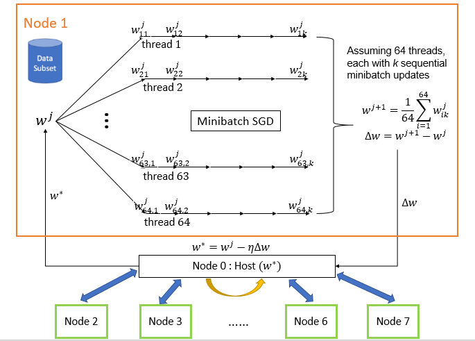

# CS 205 FINAL PROJECT REPORT 

## Parallelizing Neural Network with Improved Performance 
Chang Liu, Greyson Liu, Kamrine Poels, Linglin Huang

## Background
Despite the availability of high-frequency stock market data, its use in forecasting stock prices is studied to a lesser extent. Similarly, despite the recent success of neural network on as a forecasting method, its power in forecasting high-frequency dynamics has been relatively overlooked. In addition, most of the studies in the literature have been focused on stock market indices instead of individual stocks. A possible explanation is the intractable computational intensity of training neural networks on the massive volume of high-frequency data of individual stocks. This motivates our study on applying parallelism to the training task and evaluate its performance to demonstrate weak and strong scaling. 

## Data
We formulate the task as a prediction problem, using lagged previous prices of individual stocks to predict future prices at the minute level. The high-frequency consolidated trade data for the US equity market comes from NYSE Trade and Quote (TAQ) database, available by the WRDS research center. 

Specifically, the inputs are price and volume information at or before minute t for all stocks except stock j. 
Technical indicators of price series includes:

 1. Exponential Moving Averages (EMA) and Moving Averages (MA)
 2. Past k-period log returns
 3. Price Trend indicators (AD, Adv, ADR)
 4. Price and returns volatility over k periods
 5. Momentum: Change in price in k periods
 6. Disparity: last available price over MA
 7. PSY: fraction of upward movement in the past k-period
 
The output is the predicted return at minute t+1 for stock j. We normalize all the input and output variables using z-score and unit norm per feature:

## Methods

### Neural Network Architecture

For the prediction method, multi-layer Artificial Neural Networks (ANN) using back-propagation algorithm has shown promising results in stock index prices compared with traditional methods [1]. Note that the traditional gradient descent algorithm of back-propagation is sequential by nature. We will therefore apply a technique that combines MPI with OpenMP/CUDA for BLAS to parallelize the training process: asynchronized multiple sub-neural networks[3] with nested parallel batch <span style="color:red"> **Stochastic Gradient Descent** </span>[2].

The goal of our project is to implement a two-level parallelization model by combining MPI and OpenMP/CUDA. Unfortunately, developing executable code using OpenMP (via Cython) resulted in an onerous and difficult task, therefore, we opted for existing optimization algorithms for the update of gradients, then analyzing the nature of our algorithm by comparing time until convergence. Nonetheless, we describe our desired design and the design we used for our project below.

### Neural Network Architecture (hyperparameters)

We implement a **fully connected** network with:

1. L = 4 layers
2. number of neurons = 42,24,12,1; fewer neurons in deeper layers (pyramidal architecture)
3. Optimizer ADAM learning rate, other parameters such as momentum 
4. ReLu/MSE activation, linear activation for output node
5. L2 and maxnorm regularization, early stopping(patience=5), dropouts(20%)

### Parallelism Architecture

We execute data and model parallelism at two levels. Firstly, each machine (e.g. an Odyssey node) will store a Data Shard (a subset of data) and train a model replica independently and asynchronously (see Figure 1.) Each replica will fetch weights (𝑤) from the parameter server (the master node), compute ∆𝑤, and push ∆𝑤 to the server or master node. The parameter server updates the parameter set, whenever it receives ∆𝑤 from a model replica. We analyzed three different optimization algorithms for the update of the weights. The fetching and pushing weights and gradient weights to the master node was implemented with MPI (`mpi4py` package).


*Figure 1: Parallelised Neural Network Architecture [3]. Model replicas asynchronously fetch parameters 𝑤 and push ∆𝑤 to the parameter server.*

Secondly, each model replica aimed to compute ∆𝑤 by averaging the mini-batch gradients from 64 or 32 (depend on number of cores in a node) parallel threads (see Figure 2). We attempted to implement this level of parallelism with OpenMP (Cython parallel module). However, we were unsuccessful with this implementation, so we used OpenMP/CUDA for BLAS in each model replica and tested at different cores. 


*Figure 2: Desired parallelization in each model replica.*

### Optimization methods

- **Adaptive Gradient Algorithm (AdaGrad)**: modified SGD with parameter learning rate. Informally, this increases the learning rate for more sparse parameters and decreases the learning rate for less sparse ones. This strategy improves convergence performance where data is sparse. This optimization method is run with MPI arhitecture (see *Figure 3*)
- **Hessian-Free (Truncated Newton Method)**: an approximation of the Hessian is calculated, which saves time and computational resources, when updating using the well known Newton method. This optimization was parallelized using GPU <span style="color:red"> **due to difficulties when implementing with OpenMP.** </span>
- <span style="color:red">**Particle Swarm Optimization (PSO)**</span>: computational method that solves a problem by having a population of candidate solutions, or particles, and moving these around in the search-space according to simple mathematical formulae over the particle's position and velocity. Each particle's movement is influenced by its local best known position, but is also guided toward the best known positions in the search-space, which are updated as better positions are found by other particles. This is expected to move the swarm toward the best solutions.

AdaGrad is implemented using [Keras](https://keras.io), and Hessian-free is applied using [hessianfree](http://pythonhosted.org/hessianfree/index.html).


*Figure 3: Real architecture of our algorithm. Note that node 0 is the master node, where the optimization takes place, and node 1 through 7 (number of total nodes can and will vary) is a model replica, where the calculationg of the gradient of weight occurs.*

We test the performance of all models on predicting minute-level stock returns of Goldman Sachs in 2016. With an input size of 100,000 observations, we train a model with 75% of the stock prices and test it on the rest of the data. The batch size is 1,024 per model replica, a neural network has 3 hidden layers with 24, 12, 6 neurons, respectively. The maximum number of epochs (loosely defined as an iteration over iterations) was set to <span style="color:red">**100, and the initial learning rate is 0.001**</span>. The activation function is Relu except on the last layer, the output, where the activation function is linear. 

Within the training data, we use 80% of this dataset to train in the model replicas. After ∆𝑤 is sent to the master node, 𝑤 is updated and used to test on the rest of the training data (other 20%). As predictions get closer to true outcomes (absolute difference of loss of (i+1) iteration and i iteration is less than 10e-4), the program is stopped and we deduced convergence. If predictions were distant from true values, training continued.

#### Outline of Models

We present the layout of our model combinations and their analysis. First, we are interested in observing time until convergence and convergence rate per iteration. <span style="color:red">**We also record and compare accuracy among the models.**</span>. 

<!--  -->


*Table 1: We run Hessian-free and AdaGrad in GPU. Not included in this table, we also run AdaGrad with 3, 4, 5, 6, 7 and 8 cores at 4 cores each (using MPI), but we force an earlier stop (maximum 2000 iterations).*

## Results

## Conclusions

## Software 

# *END HERE*

First, we test the correctness of MPI implementation with data generated from a simple linear model. This is a reasonable *naïve* test case because ANN with zero hidden layers reduces to a linear regression if the activation function is linear.


*Figure 3: MPI simulation, loss function. The loss decreases almost exponentially as the number of epochs increases.*


*Figure 4: Convergence of parameters. All three parameters converged to their true values, respectively.*

The decrease in the loss between predicted and observed outcomes and the convergence to the true value demonstrate that our MPI algorithm operates correctly.

#### Performance of a Model Replica

We test the performance of a single model replica using each of the model replica algorithms versus CUDA implementation on predicting minute-level stock returns of Goldman Sachs in 2016. With an input size of 100,000 observations, we train a model with 75% of the stock prices and test it on the rest of the data. The batch size is 1,024 per model replica, a neural network has 3 hidden layers with 24, 12, 6 neurons, respectively. The maximum number of epochs (loosely defined as an iteration over iterations) was set to 100, and the initial learning rate is 0.001. The activation function is Relu except on the last layer, the output, where the activation function is linear. Below we show the average running time of the algorithms, including CUDA, which still outperforms the other optimization methods. We ran a total of 100 models for each algorithm.


<!-- Secondly, we tested the performance of a single model replica using OpenMP versus CUDA implementation on predicting minute-level stock returns of Goldman Sachs in 2016. We trained a fully-connected neural network with 4 layers (# units = [42,24,12,1]) and stop training once validation is not improving for 5 epochs. For speedup experiments, epochs are set to 100. 

 

*Figure 5: Convergence of loss function of different implementations (Max epochs = 100, batch size=128) *


*Figure 6: Speedups/thoughput (Epochs = 100) OpenMP with 32 threads and CUDA with 1 GPU machine. *

We observe that loss function converges rather quickly and has a smooth trajectory due to the relatively large size of our batches. In terms of speedups, there is a performance peak at the batch size of 128. 
-->

# Validation and Testing Methods

Because of the time series nature of the high-frequency data, we employ a walk-forward method that is suited for back-testing financial time series model. For each rolling window, we search for the best hyperparameters (#layers, nodes, etc) in the "validation timestep", and then evaluate the performance in the "testing timestep".


*Figure 6: Walk-forward method for time series prediction.*


The walk-forward method is implemented as follows: 

```python
# Input: define data[0 : T-1], training_size, validation_size, test_size, window_size
# Output: predicted values from t = T-training_size-validation_size : T-1 
for t in range(training_size + validation_size, T): 
    if t % test_size != 1:
        # predict on time t using a trained ensemble Neural Network;
    else:
        training_data = data[t - training_size- validation_size : t - validation_size]
        validation_data = data[t- validation_size: t]
        for i in range(N_window):
            # train the model based on a random starting point and \
            #       a bootstrapped sample of window_size from training_data;
            # cross-validate the architecture (# layer, neurons) 
            # calculate validation accuracy 
        # choose the top K models with highest accuracy to form an ensemble Neural Network; 
        # predicts on time t 
    # compute performance metrics on time t
```
Figure 8: Pseudo-code for backtesting

We search for the optimal network hyperparameters with:

1. Researcher’s guess (simple)
2. Grid Search (costly, inefficient)
3. Particle Swarm Optimization (embarassingly parallel, available in Python’s package Optunity/pyswarm)

We evaluate our model with the following metrics:

1. Effectiveness
    
    + Convergence of our model versus traditional implementation of sequential SGD 

2. Accuracies
    
    - MSE 
    - MSPE
    - Directional Accuracy (fraction of correct predictions of up and downs per model, consider thresholded on predicted values such that only large predicted values count)
    - Hit ratio

<span style="color:red"> **** </span>

3. Computational cost	
    + Speedups, efficiencies, and throughputs (in Gflop/s) for different number of nodes, number of cores per core, different model size (# parameters).

<span style="color:red"> **How to get Gflop/s (time is given, cores can be deduced, how to we incorporate nodes)** </span>

## Conclusion

## References
[1] Selmi, N., Chaabene, S., & Hachicha, N. (2015). Forecasting returns on a stock market using Artificial Neural Networks and GARCH family models: Evidence of stock market S&P 500. Decision Science Letters,4(2), 203-210. doi:10.5267/j.dsl.2014.12.002

[2] Valafar, Faramarz, and Okan K. Ersoy. (1993). A Parallel Implementation of Backpropagation Neural Network on MASPAR MP-1.

[3] Dean, J., et al. (2012). Large scale distributed deep networks. Proceedings of the 25th International Conference on Neural Information Processing Systems. Lake Tahoe, Nevada, Curran Associates Inc.: 1223-1231.
