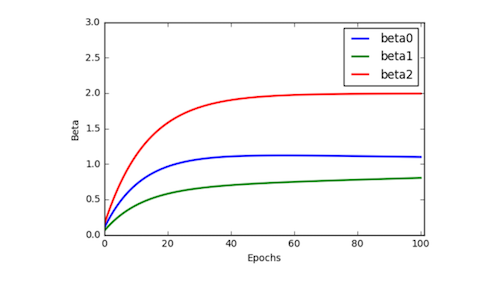

# CS 205 FINAL PROJECT INTERIM PROGRESS REPORT 

URL: https://jeffrey6557.github.io/CS205-Parallel-Computing-Project/

## Parallelizing Neural Network with Improved Performance 
Chang Liu, Greyson Liu, Kamrine Poels, Linglin Huang

## Background
Despite the availability of high-frequency stock market data, its use in forecasting stock prices is studied to a lesser extent. Similarly, despite the recent success of neural network on as a forecasting method, its power in forecasting high-frequency dynamics has been relatively overlooked. In addition, most of the studies in the literature have been focused on stock market indices instead of individual stocks. A possible explanation is the intractable computational intensity of training neural networks on the massive volume of high-frequency data of individual stocks. This motivates our study on applying parallelism to the training task and evaluate its performance to demonstrate weak and strong scaling. 


## Data
We formulate the task as a prediction problem, using lagged previous prices of individual stocks to predict future prices at the minute level. The high-frequency consolidated trade data for the US equity market comes from NYSE Trade and Quote (TAQ) database, available by the WRDS research center. 

Specifically, the inputs are price and volume information at or before minute t for all stocks except stock j. 
Technical indicators of price series includes:

 1. Intra-interval proportions (IIP)
 2. Exponential Moving Averages (EMA)
 3. Price Trend indicators (AD, Adv, ADR)
 4. Others (see Appendix)

The output is the predicted price at minute t+1 for stock j.

We normalize all the input and output variables:

1. For stock price, use returns = percentage change
2. For other values, use min-max scaling: RN = (R-R_min) / (R_max – R_min) where R is the value of an input


## Methodology and Parallelisation

### Neural Network Architecture

For the prediction method, multi-layer Artificial Neural Networks (ANN) using back-propagation algorithm has shown promising results in stock index prices compared with traditional methods [1]. Note that the traditional gradient descent algorithm of back-propagation is sequential by nature. We will therefore apply a technique that combines MPI and OpenMP to parallelize the training process: asynchronized multiple sub-neural networks[3] with nested parallel batch Stochastic Gradient Descent[2]. 


### Neural Network Architecture (hyperparameters)

We implemented a **fully connected** network with:

1.	L = 1 to 10 hidden layers
2.	number of neurons = 8~64/layer; fewer neurons in deeper layers
3.	Optimizer learning rate, other parameters such as momentum
4.	ReLu/MSE activation, linear activation for output node


### Parallelism Architecture

We execute data and model parallelism at two levels. Firstly, each machine (e.g. an Odyssey node) will store a Data Shard (a subset of data) and train a model replica independently and asynchronously (see Figure 1.) Each replica fetch weights (w) from the parameter server (the master node), compute grad(w) with SGD, and push grad(w) to the server. The parameter server updates the parameter set whenever it receives grad(w) from a model replica. We implemented this level with MPI (mpi4py package).

# Data and Model Parallelism 


Figure 1: Parallelised Neural Network Architecture [3]. Model replicas asynchronously fetch parameters w and push ∆𝑤 to the parameter server. 

Secondly, each model replica computes ∆𝑤 by averaging the mini-batch gradients from 64 or 32 (depend on number of cores in a node) parallel threads (see Figure 2). We implemented this level with OpenMP (Cython parallel module).

# Parallelism in Gradient Computation


Figure 2: Parallelisation in each model replica.


## Experiments and Preliminary Results


### Preliminary Simulations

We tested our two levels of parallelisations with several simulations.

Firstly, we tested the correctness of MPI implementation with data generated from a simple linear model. We think this is a reasonable "naive" test case because an ANN without hidden layers reduces to a linear regressor when it has linear activation functions.

#### Performance metrics of simulations using MPI


Figure 3: MPI simulation, loss function



Figure 4: MPI simulation, speed up/thoughput

Secondly, we tested the performance of OpenMP implementation.

#### Performance metrics of simulations using OpenMP
Figure 5: OpenMP simulation, loss function
Figure 6: OpenMP simulation, speed up/thoughput

Thirdly, we tested the combined model.


# Validation and Testing Methods

Because of the time series nature of the high-frequency data, we employ a walk-forward method that is suited for back-testing financial time series model. For each rolling window, we search for the best hyperparameters (#layers, nodes, etc) in the "validation timestep", and then evaluate the performance in the "testing timestep".


Figure 6: Walk-forward method for time series prediction


The walk-foward method is implemented as follows: 

```python
# Input: define data[0 : T-1], training_size, validation_size, test_size, window_size
# Output: predicted values from t = T-training_size-validation_size : T-1 
for t in range(training_size + validation_size, T): 
    if t % test_size != 1:
        # predict on time t using a trained ensemble Neural Network;
    else:
        training_data = data[t - training_size- validation_size : t - validation_size]
        validation_data = data[t- validation_size: t]
        for i in range(N_window):
            # train the model based on a random starting point and \
            #       a bootstrapped sample of window_size from training_data;
            # cross-validate the architecture (# layer, neurons) 
            # calculate validation accuracy 
        # choose the top K models with highest accuracy to form an ensemble Neural Network; 
        # predicts on time t 
    # compute performance metrics on time t
```
Figure 8: Pseudo-code for backtesting

We search for the optimal network hyperparameters with:

1. Researcher’s guess (simple)
2. Grid Search (costly, inefficient)
3. Particle Swarm Optimization (embarassingly parallel, available in Python’s package Optunity/pyswarm)

We evaluate our model with the following metrics:

1. Effectiveness
    + Convergence of our model versus traditional implementation of sequential SGD 

2. Accuracies
    + MSE 
    + MSPE
    + Directional Accuracy (fraction of correct predictions of up and downs per model, consider thresholded on predicted values such that only large predicted values count)
    + Hit ratio = mean($p_i$) where $p_i$ = 1{(y-By)($\hat{y}$-B$\hat{y}$)>0} where y is the true value $\hat{y}$ are predicted value and B is the lag operator

3. Computational cost	
    + Speedups, efficiencies, and throughputs (in Gflop/s) for different number of nodes, number of cores per core, different model size (# parameters).


## References
[1] Selmi, N., Chaabene, S., & Hachicha, N. (2015). Forecasting returns on a stock market using Artificial Neural Networks and GARCH family models: Evidence of stock market S&P 500. Decision Science Letters,4(2), 203-210. doi:10.5267/j.dsl.2014.12.002

[2] Valafar, Faramarz, and Okan K. Ersoy. (1993). A Parallel Implementation of Backpropagation Neural Network on MASPAR MP-1.

[3] Dean, J., et al. (2012). Large scale distributed deep networks. Proceedings of the 25th International Conference on Neural Information Processing Systems. Lake Tahoe, Nevada, Curran Associates Inc.: 1223-1231.


```python

```


```python

```
