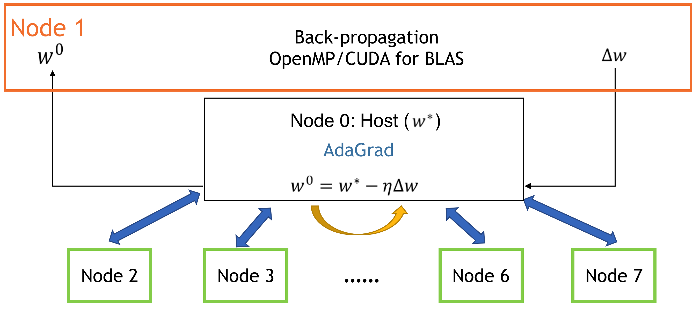
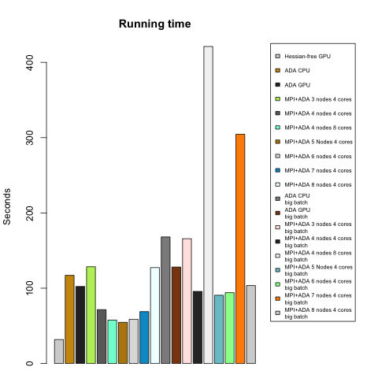
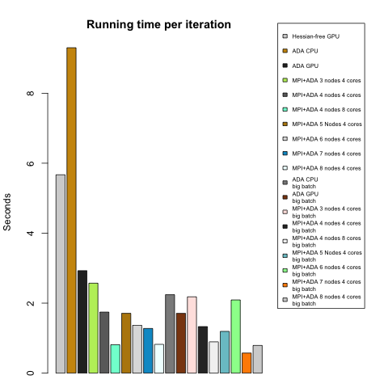
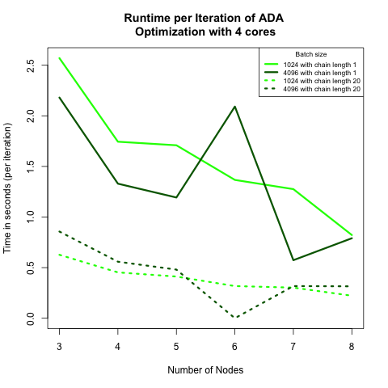

# CS 205 FINAL PROJECT REPORT

## Parallelizing Neural Network with Improved Performance
Chang Liu, Greyson Liu, Kamrine Poels, Linglin Huang

## Background
Despite the availability of high-frequency stock market data, its use in forecasting stock prices is studied to a lesser extent. Similarly, despite the recent success of neural network on as a forecasting method, its power in forecasting high-frequency dynamics has been relatively overlooked. In addition, most of the studies in the literature have been focused on stock market indices instead of individual stocks. A possible explanation is the intractable computational intensity of training neural networks on the massive volume of high-frequency data of individual stocks. This motivates our study on applying parallelism to the training task and evaluate its performance to demonstrate weak and strong scaling.

Parallel neural network has also been a topic of great interest. There are generally two aspects of parallelisation: data parallel and model parallel. Data Parallel is straightforward. Its correctness is mathematically supported, and is very commonly implemented with MPI [4]. Model parallel is more complicated. Such methods usually use multiple cores to compute values associated with multiple groups of neurons. This is usually implemented with openMP and GPU. However, it could be tricky to take care of the communications between cores/threads and to combine results (usually gradients) effectively.

## Data
We formulate the task as a prediction problem, using lagged previous prices of individual stocks to predict future prices at the minute level. The high-frequency consolidated trade data for the US equity market comes from NYSE Trade and Quote (TAQ) database, available by the WRDS research center.

Specifically, the inputs are price and volume information at or before minute t for all stocks except stock j.
Technical indicators of price series includes:

 1. Exponential Moving Averages (EMA) and Moving Averages (MA)
 2. Past k-period log returns
 3. PSY: fraction of upward movement in the past k-period
 4. Price and returns volatility over k periods
 5. Momentum: Change in price in k periods
 6. Disparity: last available price over MA

The output is the predicted return at minute t+1 for stock j. We normalize all the input and output variables using z-score and unit norm per feature.

## Methods

### Neural Network Architecture

For the prediction method, multi-layer Artificial Neural Networks (ANN) using back-propagation algorithm has shown promising results in stock index prices compared with traditional methods [1]. Note that the traditional gradient descent algorithm of back-propagation is sequential by nature. We will therefore apply a technique that combines MPI with OpenMP/CUDA for BLAS to parallelize the training process: asynchronized multiple sub-neural networks[3] with nested parallel batch Stochastic Gradient Descent[2].

The goal of our project is to implement a two-level parallelization model by combining MPI and OpenMP/CUDA. Unfortunately, developing executable code using OpenMP (via Cython) resulted in an onerous and difficult task, therefore, we opted for existing optimization algorithms for the update of gradients, then analyzing the nature of our algorithm by comparing time until convergence as well as the average runtime for each training iteration at fixed batch sizes. Nonetheless, we describe our desired design and the design we used for our project below.

### Neural Network Architecture (hyper-parameters)

We implement a **fully connected** network with:

1. L = 4 layers
2. number of neurons = 42,24,12,1; fewer neurons in deeper layers (pyramidal architecture)
3. Optimizer ADAM learning rate, other parameters such as momentum
4. ReLu/MSE activation, linear activation for output node
5. L2 and maxnorm regularization, early stopping(patience=5), dropouts(20%)

### Parallelism Architecture

We execute data and model parallelism at two levels. Firstly, each machine (e.g. an Odyssey node) will store a Data Shard (a subset of data) and train a model replica independently and asynchronously (see Figure 1.) Each replica will fetch weights (𝑤) from the parameter server (the master node), compute ∆𝑤, and push ∆𝑤 to the server or master node. The parameter server updates the parameter set whenever it receives ∆𝑤 from a model replica. This architecture is reasonable because the updating and validation process involves much less computation than back-propagation in the model replicas. We analyzed three different optimization algorithms for the update of the weights. The fetching and pushing weights and gradient weights to the master node was implemented with MPI (`mpi4py` package).

*Figure 1: Parallelised Neural Network Architecture [3]. Model replicas asynchronously fetch parameters 𝑤 and push ∆𝑤 to the parameter server.*

Secondly, each model replica aimed to compute ∆𝑤 by averaging the mini-batch gradients from 64 or 32 (depend on number of cores in a node) parallel threads (see Figure 2). We attempted to implement this level of parallelism with OpenMP (Cython parallel module). However, we were unsuccessful with this implementation, so we used OpenMP/CUDA for BLAS in each model replica (to parallel matrix computations) and tested at different cores.

*Figure 2: Desired parallelization in each model replica.*

*Figure 3: Real architecture of our algorithm. Note that node 0 is the master node, where the optimization takes place, and node 1 through 7 (number of total nodes can and will vary) is a model replica, where the calculation of the gradient of weight occurs.*

### Optimization methods

- **Adaptive Gradient Algorithm (AdaGrad)**: modified SGD with parameter learning rate. Informally, this increases the learning rate for more sparse parameters and decreases the learning rate for less sparse ones. This strategy improves convergence performance where data is sparse. This optimization method is run with MPI architecture (see *Figure 3*). Specifically, there are two message passing schemes suitable for different hardware settings:
    - Instant updating: each model replica communicates with the parameter server for every batch iteration. This scheme is suitable when the communication cost between nodes is relatively small, e.g. the seas\_iacs partition on Odyssey. It is very close to the sequential version, and converges most quickly (least number of iterations) since it makes use of information from all data shards.
    - Cumulative updating: each model replica communicates with the parameter server after a few (e.g. 20) batch iterations. This scheme is suitable when the communication cost is large since fewer message passings are needed here. However, it is possible for a model replica to get over-fitted since it only has a subset of data.

- **Hessian-Free (Truncated Newton Method)**: an approximation of the Hessian is calculated, which saves time and computational resources, when updating using the well known Newton method. However, this method updates the model parameters sequentially and does not naturally fit into our MPI parallel architecture. Therefore, we implemented a standalone version with one level of parallelisation (using GPU as a feature of the `hessionfree` pacakge).

- **Particle Swarm Optimization (PSO)**: computational method that solves a problem by having a population of candidate solutions, or particles, and moving these around in the search-space according to simple mathematical formulae over the particle's position and velocity. Each particle's movement is influenced by its local best known position, but is also guided toward the best known positions in the search-space, which are updated as better positions are found by other particles. This is expected to move the swarm toward the best solutions.

AdaGrad is implemented using [Keras](https://keras.io), and Hessian-free is applied using [hessianfree](http://pythonhosted.org/hessianfree/index.html), parallel Particle Swarm Optimization is implemented mulitprocessing module in python and adapted from [here](https://jamesmccaffrey.wordpress.com/2015/06/09/particle-swarm-optimization-using-python/).

#### Validation and Testing

Because of the time series nature of the high-frequency data, we employ a walk-forward method that is suited for back-testing financial time series model, instead of k-fold cross-validation, to avoid forward-looking bias. For each rolling window, we determine if for each  epoch, our iterative machine learning algorithms (Adagrad, Hessian Free, Particle Swarm Optimization) should stop the training process based on the loss calculated on the "validation timestep". If we do terminate the algorithm, we then evaluate the performance of the final model in the "testing timestep". For simplicity and fair comparison, we used window size = 1 for all the algorithms, because for some algorithm like sequential Particle Swarm Optimization, running one window frame can take more than 7 hours on Odyssey.

We test the performance of all models on predicting second-level stock returns of Goldman Sachs in 2016. With an input size of 100,000 observations, we train a model with 75% of the stock prices and test it on the rest of the data. The batch size is 1,024 or 4096 per model replica, a neural network has 2 hidden layers with 24, 12 neurons, respectively. The maximum number of epochs (loosely defined as the number of minibatch update) was set to 2000, and the initial learning rate is 0.01. The activation function is Relu except on the last layer, the output, where the activation function is linear.

Within the training data, we use 80% of this dataset to train in the model replicas. After ∆𝑤 is sent to the master node, 𝑤 is updated and used to test on the rest of the training data (other 20%). As predictions get closer to true outcomes (absolute difference of loss of (i+1) iteration and i iteration is less than 10e-4), the program is stopped and we deduced convergence. If predictions were distant from true values, training continued.

#### Outline of Experiments

We present the layout of our model combinations and their analysis. First, we are interested in the observed time until convergence and average time per iteration. We also record and compare accuracy among the models. Moreover, we observe the behavior of some of our algorithms (MPI+ADA) when we set a minimum length of iterations in each model replica. We vary this minimum limit by comparing 1 vs 20 minimum iterations.

*Table 1: We run Hessian-free and AdaGrad in GPU. Not included in this table, we also run AdaGrad with 3, 4, 5, 6, 7 and 8 cores at 4 cores each (using MPI), but we force an earlier stop (maximum 2000 iterations).*

## Results

Figure 4 and 5 compares the running time till convergence and average running time per iteration respectively. We conclude that Hessian-free with GPU performs the best in terms of total runtime till convergence. As for Adjusted gradient (ADA) methods, though each iteration runs fast on average, they usually need more iterations to converge, and variance of the number of iterations is large. These observations fit our expectation because ADA based methods are more stochastic.

*Figure 4: Total time until convergence for all models/algorithms. Models with description 'big batch' were trained using a batch size of 4096 observations.*

+*Figure 5: Time until convergence per iteration for all models/algorithms. Models with description 'big batch' were trained using a batch size of 4096 observations.*

Figure 6 shows the strong scaling. We find in both graphs, the batch size does not affect the runtime too much. This suggests in each model replica, matrix computations are well handled, and can is not a bottleneck of our algorithm. Comparing the curves for different chain lengths, we see that chain length = 1 (instant updating scheme) leads to longer average per iteration time, but shorter overall convergence time. These observations support the specification in Optimization Methods section. We suppose that if the communication cost is high (internet speed, data chunk sizes, communication barriers, etc.), the cumulaive updating scheme could outperform the instant version.

*Figure 6: (left) Total time until convergence by node for all ADA algorithms run with 4 cores. Dashed lines belong to algorithms where each model replica had to run 20 iterations before pushing gradient weight to master node. We would expect a longer time among the latter algorithm. (Right) Time until convergence per iteration by node for all ADA algorithms run with 4 cores. Notice that algorithms with at least 20 iterations in model replica (dashed lines) are faster by iteration than the other two algorithms (solid lines).*

In figure 6 to the right, we examined the predictive accuracy of our models. The baseline accuracy is ~40%. We find none of these methods give high accuracies (e.g. >80%). Apart from the inherent difficulties of predicting stock price data, we could probably gain higher accuracies if we have larger input dimensions (e.g. more indexes, make use of time dependencies of timestamp data, etc.) or more suitable network structures (e.g. dropouts, recursive neural networks, deeper network, etc.) A worrying observation is that MPI based models seem to have higher variances in accuracies. We think it could be helpful to run model "multiple times", by shuffling and re-scattering data to data shards.

*Figure 7: Accuracies of all models, which ranged from 0.4153 (MPI+ADA 6 nodes and 4 cores on large batch size) to 0.5849 (MPI+ADA 8 nodes and 5 cores on smaller batch).*

## Conclusions and Discussions

We implemented 3 types of neural network learning methods: ADA (SGD), Hessian-free, and PSO. Specifically, for ADA, we implemented two-level parallelization: down-pour SGD with MPI to asynchronously manage model parameters, and model replica with openMP (or GPU if computational resources available) to perform back-propagations. We analyzed both time to convergence and average runtime per epoch, and conclude that (1) MPI+openMP allows strong scaling, and (2) choice of updating scheme significantly affects runtime to convergence.

In our experiments, we find there are significant overheads for initializing MPI, OpenMP and GPU settings, but did not observe too much communication cost. We think this is because the nodes in seas\_iacs partition on Odyssey are connected with high-speed Infiniband network, and the nodes finish the same amount of computation at different times due to differences in computational throughput. If the nodes have very similar computational performance in the MPI world, we may also vary the batch size for each model replica such that the updating process can be asyncronized.

## Software

## References
[1] Selmi, N., Chaabene, S., & Hachicha, N. (2015). Forecasting returns on a stock market using Artificial Neural Networks and GARCH family models: Evidence of stock market S&P 500. Decision Science Letters,4(2), 203-210. doi:10.5267/j.dsl.2014.12.002

[2] Valafar, Faramarz, and Okan K. Ersoy. (1993). A Parallel Implementation of Backpropagation Neural Network on MASPAR MP-1.

[3] Dean, J., et al. (2012). Large scale distributed deep networks. Proceedings of the 25th International Conference on Neural Information Processing Systems. Lake Tahoe, Nevada, Curran Associates Inc.: 1223-1231.

[4] Chanthini, P., and K. Shyamala. "A survey on parallelization of neural network using MPI and Open MP." Indian Journal of Science and Technology 9.19 (2016).
